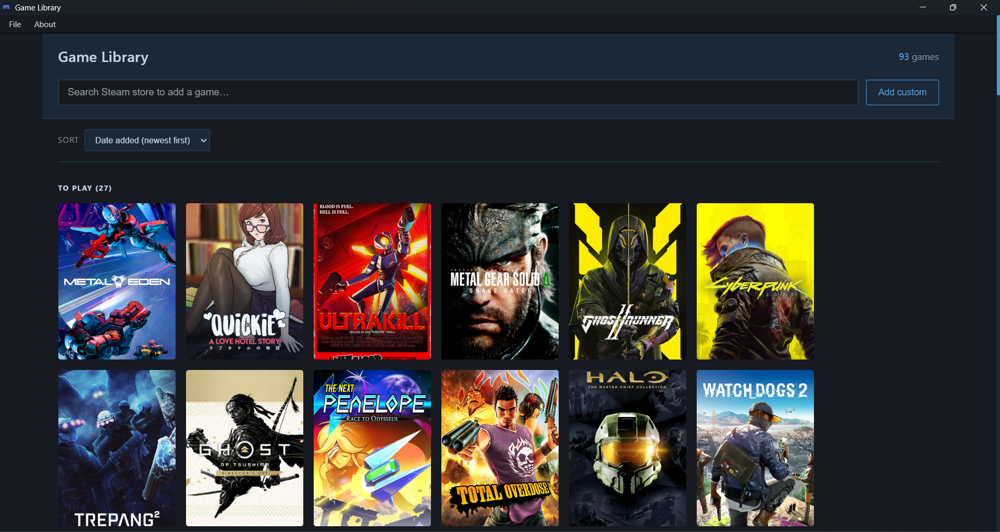

# Game Library

A local desktop application for tracking your personal game collection, built with Electron and styled with a Steam-inspired dark UI theme.



## Features

### Core Library
- **Backlog** — keep track of games you want to play
- **Completed** — mark games as finished and move them to your completed collection
- Move games between sections with a single click — checkmark to complete, minus to move back
- Remove games with the delete button on hover

### Steam Integration
- Search the Steam store directly from the app
- Automatically fetches game cover art, title, and store page link
- Clicking a game tile opens its Steam store page in your browser
- Tags and genre data imported from Steam for each game

### Custom Games
- Add non-Steam games manually with a custom name and cover image
- Custom games work identically to Steam games across all features

### Personalized Suggestions
- Suggested For You section powered by Steam's own recommendation data
- Suggestions based on your completed games using Steam's "more like this" engine
- Manually select which completed games drive your suggestions via the game selection dialog
- Filter suggestions by tag using the tag filter bar
- Refresh suggestions manually or automatically when your library changes

### Library Management
- Export your library as a JSON file for backup or transfer
- Import a library from a JSON file with two options — Replace or Merge
- Merge intelligently deduplicates games by Steam ID
- Completed status always wins on merge — your furthest progress is always preserved

### UI and Experience
- Steam-inspired dark navy theme throughout
- Portrait game cards with hover-reveal overlay animation
- Slide-in info bar showing game title and action button on hover
- Custom polygonal checkmark and minus icons matching Steam's icon language
- Sort library by date added or name
- Tag filter pills in the suggestions section
- Compact tag overflow panel for browsing all available tags
- Custom Steam-themed merge and game selection dialogs
- Smooth refresh animation on app reload
- Ctrl+R keyboard shortcut for quick refresh

### Data and Privacy
- All library data stored locally on your machine
- No account required, no data sent to any server
- Steam API calls are read-only, fetching only public store information
- Data stored at `AppData\Roaming\Game Library\games.json`

---

## Installation

### Option 1 — Portable exe (recommended)
1. Download `Game Library 1.0.0.exe` from the [Releases](https://github.com/SassyCortana007/Sassy-Game-Library/releases) page
2. Run it directly — no installation needed
3. Your library data is automatically created on first use

### Option 2 — Run from source
Make sure you have [Node.js](https://nodejs.org/) installed, then:

```bash
git clone https://github.com/SassyCortana007/Sassy-Game-Library.git
cd Sassy-Game-Library
npm install
npm start
```

---

## Usage

### Adding a Steam game
Type a game name in the search bar at the top. Results appear from the Steam store — click one to add it to your Backlog. Cover art, title, and store link are fetched automatically.

### Adding a custom game
Click the "Add Custom" button, enter the game name, and pick a cover image from your PC. Custom games are marked with a small badge.

### Tracking progress
Hover over any game card to reveal the action buttons. Click the green checkmark to move a game to Completed. Click the blue minus in Completed to move it back to Backlog.

### Getting suggestions
Complete some games and the Suggested For You section automatically populates with Steam-recommended titles. Click the "Based on" pill to manually select which completed games drive your suggestions. Use the tag filter pills to narrow results by genre.

### Exporting and importing
Use File → Export Library to save your data as a JSON backup file. Use File → Load Library to restore or merge a previously exported library. On import, choose Merge to combine with your existing library or Replace to overwrite it entirely.

### Refreshing the app
Use File → Refresh or press Ctrl+R if anything in the UI needs a reset or if you reconnected to the internet and want to reload images and suggestions.

---

## Data Storage

Your game library is stored locally at:
C:\Users\YourName\AppData\Roaming\Game Library\games.json

This file is created automatically on first use. Back it up using File → Export Library before reinstalling Windows or moving to a new machine.

---

## Built With

- [Electron](https://www.electronjs.org/) — desktop app framework
- [electron-builder](https://www.electron.build/) — packaging and distribution
- HTML, CSS, JavaScript — UI and app logic
- [Steam Store API](https://store.steampowered.com/api/) — game metadata, cover art, and recommendations

---

## Requirements

- Windows 10 or Windows 11 (64-bit)
- Internet connection for Steam search and suggestions
- No internet required to view your existing library

---

## Roadmap

Possible future additions:
- Notes per game
- Star rating for completed games
- Currently Playing status
- Statistics page
- Grid and list view toggle

---

## License

MIT — see [LICENSE](LICENSE) for details.

---

## Author

Made by [SassyCortana007](https://github.com/SassyCortana007)